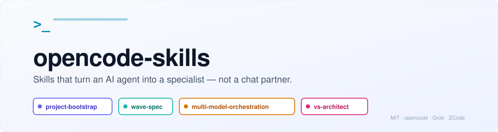

<picture>
  <source media="(prefers-color-scheme: dark)" srcset="docs/assets/hero-dark.svg">
  <source media="(prefers-color-scheme: light)" srcset="docs/assets/hero-light.svg">
  
</picture>

# opencode-skills

🇬🇧 [English version](README.md) · **Русский**

**Скиллы, которые делают из AI-агента специалиста по конкретному делу — а не собеседника.**

Каждый скилл — это набор инструкций, шаблонов, скриптов и справочных материалов, который кладётся в [opencode](https://github.com/opencode-ai/opencode) (или любой совместимый CLI) и объясняет агенту, как делать одно дело хорошо: развернуть структуру проекта, провести спринт по плану, свести несколько моделей для ревью, разорвать mode-collapse.

Никакого рантайма. Никакой привязки. Только файлы, которые агент читает по необходимости.

---

## Четыре скилла

| Скилл | Одной строкой | Когда использовать |
|-------|---------------|--------------------|
| [**project-bootstrap**](skills/project-bootstrap/) | За одну сессию генерирует «дом» для агента в проекте — `AGENTS.md`, handoff, memory, правила, с адаптацией под тип проекта и модель. | Начинаете новый проект или вытягиваете существующий — и хотите сразу правильную агентскую инфраструктуру. |
| [**wave-spec**](skills/wave-spec/) | Plan-gate скилл для спринтов и волн: `INTENT → интервью → SPEC/PLAN → утверждение → dispatch → lifecycle gates`. Портативный между OpenCode, ZCode, Qwen Code. | Запускаете многосессионный спринт, волну контента/перевода или работу, где нельзя пропускать планирование. |
| [**multi-model-orchestration**](skills/multi-model-orchestration/) | Сводит 2+ AI-модели (DeepSeek V4 Flash, Qwen 3.8 Max, GLM 5.2, GPT-5.5) для параллельного ревью, кросс-валидации или массовой работы через Orca. | Нужны независимые перспективы, fidelity-порт или security/RLS-ревью, который одна модель не закроет. |
| [**vs-architect**](skills/vs-architect/) | Verbalized Sampling ([arXiv 2510.01171](https://arxiv.org/abs/2510.01171)) — генерирует разнообразные варианты решения с оценками вероятности. | Выбираете между подходами, дебажите неизвестный root cause или выходите из mode-collapse. |

### Какой скилл когда?

```
Новый проект, «настрой структуру агента»           →  project-bootstrap
Спринт/волна, где нельзя пропускать планирование   →  wave-spec
2+ модели для ревью, кросс-валидации, массы работы →  multi-model-orchestration
Разнообразные варианты с вероятностями             →  vs-architect
```

Три планировочных скилла работают в цепочке: **project-bootstrap** строит «дом» агента → **wave-spec** ведёт спринт внутри него → **multi-model-orchestration** кросс-ревьюит результат. **vs-architect** — отдельный инструмент для размышлений.

---

## Установка

```bash
git clone git@github.com:dimkurilo/opencode-skills.git ~/Projects/opencode-skills

# симлинк нужных скиллов в opencode
for skill in project-bootstrap wave-spec multi-model-orchestration vs-architect; do
  ln -sfn ~/Projects/opencode-skills/skills/$skill ~/.config/opencode/skills/$skill
done
```

Ручная установка без симлинков: `cp -R skills/<name> ~/.config/opencode/skills/<name>`. opencode подхватывает новые скиллы при следующем запуске.

Несколько скиллов также ставятся в **Grok** (`~/.grok/skills/`) и другие CLI, следующие той же конвенции `SKILL.md`.

---

## Что внутри скилла

```
skills/<name>/
├── SKILL.md                # главные инструкции + YAML frontmatter (name, description)
├── README.md / README.ru.md
├── references/             # справочные материалы, примеры, теория
├── assets/templates/       # шаблоны генерации с ${VARIABLE} плейсхолдерами
└── scripts/                # вспомогательные shell/Python скрипты (lint, verify, classify)
```

Frontmatter `description` говорит хост-агенту **когда** загружать скилл. Тело — это workflow. References подгружаются по необходимости. Templates генерируют артефакты (`SPEC.xml`, `PLAN.xml`, `AGENTS.md`, брифы, handoff-ы), которые скилл производит.

---

## Создание своих скиллов

Та же конвенция: директория под `skills/`, `SKILL.md` с frontmatter (`name`, `description` — описывает **когда** использовать, не только что), опционально `references/`, `assets/templates/`, `scripts/`. Скиллы `skill-creator` и `skill-audit` (из `~/.config/opencode/skills/`) помогают писать и ревьюить.

---

## Репозиторий

```
opencode-skills/
├── README.md / README.ru.md
├── CHANGELOG.md
├── LICENSE                 # MIT
└── skills/
    ├── project-bootstrap/
    ├── wave-spec/
    ├── multi-model-orchestration/
    └── vs-architect/
```

Публичный, лицензия MIT. Идеи из [PromptPasture/agent.md](https://github.com/PromptPasture/agent.md), [Cursor Rules](https://cursor.com/docs/rules), [OpenCode Rules](https://opencode.ai/docs/rules/), [vv-opencode](https://github.com/osovv/vv-opencode) и [Agent1st Protocol](https://github.com/dimkurilo/agent1st-protocols).

## Лицензия

MIT
