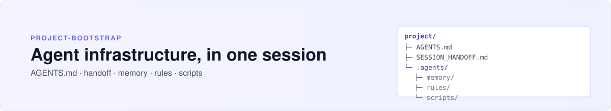

<picture>
  <source media="(prefers-color-scheme: dark)" srcset="assets/hero-dark.svg">
  <source media="(prefers-color-scheme: light)" srcset="assets/hero-light.svg">
  
</picture>

# project-bootstrap

🇬🇧 [English version](README.md) · **Русский** · [← все скиллы](../../README.md)

**Агентская инфраструктура для проекта, за одну сессию.**

Дайте новому проекту (или существующему, но запутанному) агента с этим скиллом — и он построит полный «дом», в котором агент работает: контракт `AGENTS.md`, файлы handoff и памяти, правила, скрипты, `.gitignore` — с адаптацией под тип проекта и модель.

---

## Когда использовать

- Начинаете новый проект и хотите сразу правильную агентскую инфраструктуру.
- Сказали что-то вроде «настрой проект», «разверни агента», «создай структуру».
- Вытягиваете существующий проект, где агент теряет контекст или забывает решения.

**Не используйте** для мелких правок, аудита или уже настроенного проекта — у скилла есть режим расширения для добавления частей в рабочую конфигурацию, а не полный ребилд.

## Что генерирует

```
<project>/
├── AGENTS.md              # универсальный контракт: правила преамбулы, протокол, иерархия
├── SESSION_HANDOFF.md     # что происходит сейчас (фаза, задачи, окружение) — в gitignore
├── .gitignore
├── plan.md                # опционально — стратегический план
└── .agents/
    ├── memory/MEMORY.md   # долговременная память: факты, нерешённые вопросы, правила
    ├── rules/             # переиспользуемые правила (general, skill-conventions, release-flow)
    ├── commands/          # /commands, которые агент может запускать
    ├── scripts/           # classify, lint, verify, release-хелперы
    └── skills/            # проектные скиллы
```

Каждый файл адаптирован под **тип проекта** (`ops`, `code`, `agent`, `content`) и **модель** (DeepSeek / GLM / Qwen / универсал). Контентный проект получает другой набор правил, чем кодовый; проект под Qwen — модель-специфичные правила дисциплины.

## Как работает

1. **Классификация** — `scripts/classify_project.sh` читает задачу и определяет тип проекта + сложность.
2. **Шаблон** — выбирается нужный набор из `assets/templates/` (15 шаблонов: `AGENTS.md.tmpl`, `MEMORY.md.tmpl`, `SKILL.md.tmpl`, `rule.md.tmpl`, …).
3. **Генерация** — файлы пишутся с подстановкой `${VARIABLE}` из задачи.
4. **Contradiction check** — правила преамбулы vs closing anchors (без конфликтов правил).
5. **Двойной аудит** — структура + контент проверяются перед Done.

Скилл построен на **Variant E + GRACE-якоря**: самые важные правила дублируются — в преамбуле (primacy) и в closing anchors (recency) — чтобы модель не уплывала от них в длинной сессии.

## Установка

```bash
ln -sfn ~/Projects/opencode-skills/skills/project-bootstrap \
  ~/.config/opencode/skills/project-bootstrap
```

Потом скажите агенту: «настрой этот проект».

## Пример сессии

> **Вы:** Новый проект — контентный сайт для небольшого журнала, на DeepSeek. Настрой структуру агента.
>
> **Агент** *(загружает project-bootstrap)*: запускает `classify_project.sh` → тип=`content`, модель=`deepseek` → генерирует `AGENTS.md` с правилами контентного проекта, `SESSION_HANDOFF.md`, `.agents/memory/MEMORY.md`, `.agents/rules/` с контентными конвенциями, `classify_project.sh` установлен. Contradiction check проходит. Отчитывается что создано и почему.

## Что внутри

- **References:** `model-profiles.md` (поведение DeepSeek/GLM/Qwen + антипаттерны), `playbook.md`, `grace-anchors.md`, `variant-e-structure.md`, `workflow-patterns.md`, `operational-rules.md`.
- **Шаблоны (15):** `AGENTS.md.tmpl`, `MEMORY.md.tmpl`, `SESSION_HANDOFF.md.tmpl`, `SKILL.md.tmpl`, `rule.md.tmpl`, `command.md.tmpl`, `agent-persona.md.tmpl`, `opencode-agent.md.tmpl`, `nda-anonymization.md.tmpl`, `script.sh.tmpl`, `script.py.tmpl`, `plan.md.tmpl`, `general-rule.md.tmpl`, `api-config.example.tmpl`, `YYYY-MM-DD.md.tmpl`.
- **Скрипты:** `classify_project.sh`, `verify-handoff-gate.sh`.

## Роутер

Это **точка входа** планировочного трио:

```
новый проект → project-bootstrap → (внутри) wave-spec → multi-model-orchestration
```

## Лицензия

MIT · часть [opencode-skills](../../README.md)
