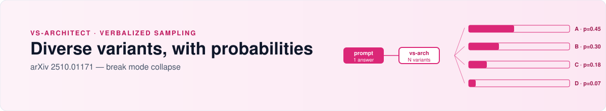

<picture>
  <source media="(prefers-color-scheme: dark)" srcset="assets/hero-dark.svg">
  <source media="(prefers-color-scheme: light)" srcset="assets/hero-light.svg">
  
</picture>

# vs-architect

🇷🇺 [Русская версия](README.ru.md) · **English** · [← all skills](../../README.md)

**Generate diverse solution variants with probability estimates — and break out of mode collapse.**

Implements Verbalized Sampling ([arXiv 2510.01171](https://arxiv.org/abs/2510.01171)). Instead of asking a model for *the* answer, you ask for *N diverse candidate answers*, each with a self-estimated probability. The spread itself is the signal: a narrow distribution means the model is sure, a wide one means you should investigate before committing.

---

## When to use

- You're **choosing between multiple approaches** and a direct prompt keeps returning the same one.
- **Debugging with unknown root cause** — you need hypotheses, not the first guess.
- **Generating hypotheses or synthetic data** — diversity is the point.
- A direct prompt produces **repetitive, mode-collapsed** responses.

**Don't use it for** trivial scripts, factual queries ("what's the capital of France"), or stable production code where one direct answer is more reliable.

## How it works

A direct prompt → one answer (whatever the model's prior favors).

**vs-architect** → N variants, each with:
- a distinct framing or assumption,
- a self-estimated probability (`p = 0.X`),
- a one-line reason for that probability.

The variants are sampled to be **meaningfully different** — not paraphrases of the same idea. You read the distribution:

```
Variant A — p=0.45   "the obvious path, but check X first"
Variant B — p=0.30   "alternative if A's assumption fails"
Variant C — p=0.18   "long shot, but cheap to test"
Variant D — p=0.07   "edge case, ignore unless ..."
```

If A and B are close, the model isn't sure — investigate. If A dominates, commit.

## When it pays off

- **Architecture decisions** where 2-3 viable designs exist and you want them surfaced explicitly instead of Anchoring on the first.
- **Root-cause debugging** where the bug has several plausible causes — you want the hypotheses ranked, not a single fix that might miss.
- **Creative / strategy work** where the value is in the range of options, not the average.
- **Mode-collapse exit** — when the model is stuck repeating itself, forcing N diverse variants breaks the loop.

## Install

```bash
ln -sfn ~/Projects/opencode-skills/skills/vs-architect \
  ~/.config/opencode/skills/vs-architect
```

## Example session

> **You:** We're choosing between Redis, Postgres+LISTEN, and a managed queue for a small async-notifications service. vs-architect — 4 variants with probabilities.
>
> **Agent** *(loads vs-architect)*: produces 4 distinct framings — (A) Postgres+LISTEN p=0.40 (you already run Postgres, ops cost low), (B) managed queue p=0.30 (less code, recurring cost), (C) Redis Streams p=0.20 (fast, new infra), (D) poll-the-database p=0.10 (ugly, zero new deps). Each with the assumption that flips it. You read the distribution: A and B together = 0.70, so the real decision is "do we want to operate this or pay for it?" — and that's a question for you, not the model.

## What's inside

- **References:** `vs-theory.md` — the Verbalized Sampling method, why verbalized probabilities work, when they don't. `examples.md` — worked examples across architecture, debugging, strategy.

## Router

Standalone thinking tool — not part of the project-bootstrap/wave-spec/multi-model-orchestration chain. Use it wherever a direct prompt feels stuck or narrow.

## License

MIT · part of [opencode-skills](../../README.md) · method: [arXiv 2510.01171](https://arxiv.org/abs/2510.01171)
